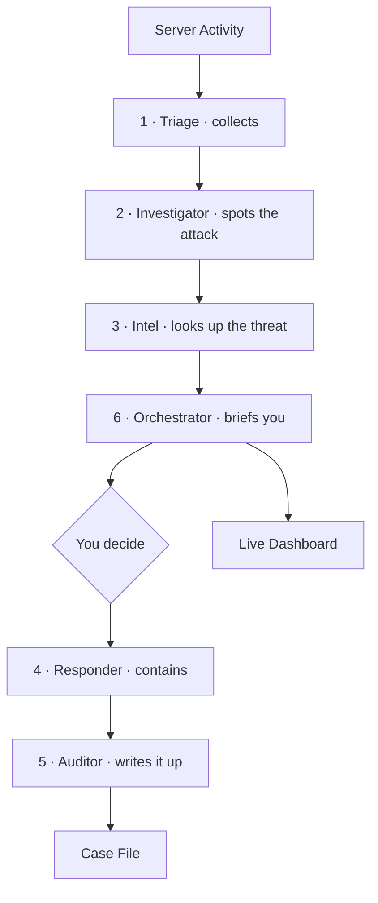

# Agentic SOC - Multi-Agent Security Operations Center

> A 24/7 security monitoring platform that detects cyber attacks in real time and guides a human analyst through response - combining the speed of automation with the judgment of a person at every critical decision.


---

## The idea

A real Security Operations Center is a team of people, each with a clear job, someone watches the alerts, someone investigates the suspicious ones, someone looks up whether an address is known-bad, someone decides what to do, someone carries out the fix, and someone writes up what happened.

This project asks a simple question: **what if each of those roles were its own agent, and they worked a case together from start to finish - on their own?**

So that's how it was built. Six agents, one per real-world SOC role, coordinated by a single conductor. They watch the system continuously, spot attacks that unfold across multiple steps, and package each incident into a clear, decision-ready brief. But they never pull the trigger alone. At the one moment that actually matters *should we contain this?* a human makes the call. The machines handle the speed and the paperwork; the person keeps the judgment. That's the whole philosophy: **automate the work, keep the human in the loop.**

---

## How a case flows



---

## The six agents

This is the heart of the system. Each agent owns one job on the SOC floor, and a case passes through them in order.

### 1 · Triage - the watcher

Triage is the always-on collector. It tails every important log on the host at once, each in its own thread, and the moment a line is written it parses it into a clean, uniform record dropped into a shared 24-hour buffer that the rest of the team reads from.

The logs it watches:

- **Suricata `eve.json`** - intrusion-detection alerts and network flow records (who talked to whom, and how many bytes moved)
- **`auth.log`** - SSH logins, failures, sudo use, new accounts
- **`syslog`** - system services, cron jobs, kernel events
- **Apache `access.log` / `error.log`** - web requests and scanner activity
- **UFW firewall log** - blocked and allowed connections
- **Nextcloud log** - file-app access and errors

On top of tailing, Triage tracks the size of each log file - if one suddenly shrinks, that's a classic sign of an attacker wiping their tracks, and it flags it. Triage never decides what's dangerous; it just makes sure everything is seen and nothing is filtered out before the analysts look.

### 2 · Investigator - the analyst

The Investigator is the detection brain, and it runs on plain logic - no AI. Every few minutes it groups the buffered events by source address and looks for *sequences* that tell an attack story. It ships with seven correlation rules:

- **R1 · Recon to Exploit** - a port scan followed by an exploit or login attempt from the same address
- **R2 · Brute-Force Success** - five or more failed logins followed by a successful one from the same address
- **R3 · Login to C2** - a successful login immediately followed by an outbound connection to the internet (possible command-and-control)
- **R4 · Lateral Movement** - an internal machine scanning several other internal machines
- **R5 · Data Exfiltration** - a login from a brand-new address followed by a large outbound transfer
- **R6 · Off-Hours Activity** - external access during the dead-of-night window (02:00-05:00)
- **R7 · Log Tampering** - a monitored log file shrinking, flagged from Triage's size tracking

When a rule matches, the Investigator opens a ticket. Reading across events like this is what separates a real intrusion from ordinary background noise - and it's what keeps the operator from drowning in single-event alerts.

### 3 · Intel - the researcher

Once a ticket exists, Intel adds the outside context. It takes each suspicious external address and checks it against threat databases - is it a known attacker, a Tor exit node, a malware command server? It uses two always-free feeds (the Tor exit list and the Feodo C2 tracker) and, if keys are provided, richer lookups from AbuseIPDB and IPinfo for reputation scores, country, and network owner. Internal addresses are never sent to outside services, and if a source is unreachable it simply notes that and moves on. The result turns a bare address into a verdict you can act on.

### 4 · Responder - the operator

The Responder is the only agent that changes anything on the system, and it acts strictly on the operator's approval. Before touching anything it photographs the scene - capturing live sessions, open connections, running processes, and firewall state - so evidence survives the fix. Then it contains the threat according to the type of attack:

- **Brute force / suspicious login (R2, R6)** - blocks the source address at the firewall and terminates the attacker's active session
- **Recon-to-exploit (R1)** - blocks the source and rate-limits the targeted service
- **Command-and-control / exfiltration (R3, R5)** - blocks the outbound destination to sever the channel, then kills the local session
- **Lateral movement (R4)** - isolates the offending internal host at the firewall
- **Log tampering (R7)** - preserves current state immediately and locks the implicated account

Every action is logged with the exact command used and how to reverse it, and anything that could lock the operator themselves out (like the admin account or the SSH path) is refused and handed back for manual review.

### 5 · Auditor - the scribe

The Auditor turns a closed case into a proper security record, built around the frameworks a real SOC is measured on. Every incident is mapped to **MITRE ATT&CK** - the industry-standard catalogue of attacker tactics and techniques - so each detection carries its technique IDs (T1110 for brute force, T1048 for exfiltration, T1071 for C2, and so on) and the tactic it belongs to. The case file lays out a full timeline, the indicators of compromise involved, that ATT&CK mapping, and tailored remediation steps that echo the containment-eradication-recovery flow of the **NIST / SANS incident-response lifecycle**. The write-up is what makes the work auditable - for learning, for compliance, and for proving exactly what happened.

### 6 · Orchestrator & Vega - the shift lead

The sixth role is the conductor, and it comes in two halves that split the work between deterministic machinery and a human-facing intelligence.

The **Orchestrator** is a standalone Python service that runs the floor. It starts Triage's watchers, schedules the Investigator every few minutes, and routes each new case through Intel, Responder, and Auditor in the right order. When a case is ready it assembles a short, structured brief - severity, the rule that fired, the enriched indicators, and four numbered response options - and pushes it straight to your phone over the Telegram API. This outbound path is pure Python with no language model in it, which is why it costs nothing per alert and can run non-stop.

The other half is **Vega** - the persona that talks to you and listens for your reply. Vega runs on the **Hermes agent framework**, which gives her the things a standalone script doesn't have: a hosted identity, tool access, persistent memory, and a messaging gateway wired into Telegram. Hermes is what lets a language model *act* like a team member rather than just answer questions.

**Vega's persona.** She's written as a calm, precise SOC shift-lead - the steady voice on the radio during an incident. Her character lives in a `SOUL.md` file that Hermes loads on every turn: she speaks in the vocabulary of a real operations floor (a ticket is a *case*, the queue is the *case ledger*, activity gets noted to the *board*), she's economical with words, never alarmist, and always defers the final containment decision to the human operator. That last trait is deliberate - Vega is built to advise and execute, never to decide on her own.

**Where the language model actually sits.** The LLM (**DeepSeek, served through OpenRouter and orchestrated by Hermes**) is used at exactly one point: understanding you. When you reply to a case on Telegram - whether you send a clean `CASE-0138 2` or something loose like "soft-contain the second one" - it's Vega, through Hermes, who interprets the intent and writes a small handoff file the Orchestrator is watching. The Orchestrator reads that file and dispatches the Responder. The model never sees a raw log line and never makes a detection or containment call; it only turns your natural-language instruction into a structured action.

This two-halves design also solves a real constraint: Telegram only delivers messages to a single poller per bot, so the Orchestrator *sends* while Vega/Hermes *receives*. Machine speed on the outbound side, human-aware intelligence on the inbound side, with a simple file as the handshake between them.

---

## Live dashboard

A lightweight web dashboard gives a real-time view of the whole operation - agent health, the ticket board, attack-pattern metrics with MITRE ATT&CK coverage, and a live feed of events as they arrive. Open it from any device on the network.

---

## Tech stack

Deliberately lean - the entire runtime is Python's standard library, so there's nothing to `pip install`.

| Technology | Why it's used |
|------------|---------------|
| **Python 3.10+** (stdlib: `threading`, `http.server`, `urllib`, `json`) | Language for all six agents and the dashboard - concurrent log watchers, the web server, API calls, and the shared JSON event store, with zero third-party packages. |
| **systemd** | Runs the orchestrator and dashboard as always-on services that auto-restart. |
| **Linux (Ubuntu 24.04)** | Host OS the whole system is built around. |
| **Suricata** (IDS) | Primary intrusion-detection feed - alerts and network flows. |
| **UFW** (firewall) | Traffic log for detection, and the tool the Responder uses to block IPs. |
| **auth.log / syslog / Apache / Nextcloud** | System, web, and app logs - the raw material for detection. |
| **MITRE ATT&CK** | Framework every detection rule and case file is mapped to. |
| **NIST / SANS IR lifecycle** | Shapes the containment-eradication-recovery steps in each case file. |
| **sudo / sudoers** | Scoped, passwordless permissions so the Responder runs only its specific commands. |
| **Hermes Agent Framework** | Hosts the Vega persona - identity, tools, memory, and the Telegram gateway. |
| **OpenRouter + DeepSeek** | LLM used *only* to interpret the operator's reply - never for detection. |
| **Telegram Bot API** | The operator console - briefs out, decisions in. |
| **AbuseIPDB · IPinfo** | Optional threat-intel lookups used by the Intel agent. |
| **Tor exit list · Feodo Tracker** | Free, key-less threat feeds - always on, no signup. |
| **Chart.js** (CDN) | Renders the dashboard's metrics and MITRE-coverage charts. |

---

## Quickstart

```bash
git clone https://github.com/<you>/agentic-soc.git
cd agentic-soc

cp .env.example .env      # set your server IPs + Telegram keys
chmod +x setup.sh
./setup.sh                # installs and starts everything
```

Runs on any Linux host with Python 3.10+. Telegram and threat-intel keys are optional - it works without them.

---

## What makes it different

- **Automate the work, keep the human in the loop** - no containment ever runs without a person's approval.
- **Reads stories, not single events** - attacks are caught as multi-step sequences, which is how real intrusions actually look.
- **Cheap enough to run 24/7** - the detection engine is plain logic, not expensive AI calls; language models are used only to write your brief.
- **Evidence before action** - the scene is always preserved before anything is changed.

Full architecture reasoning lives in [`docs/DESIGN.md`](docs/DESIGN.md).

---

## Disclaimer

Built as a home-lab portfolio project - a detection and response *aid*, not a certified security product. Review the approved actions in `agents/responder.py` before deploying anywhere that matters.

## License

MIT - see [LICENSE](LICENSE).
