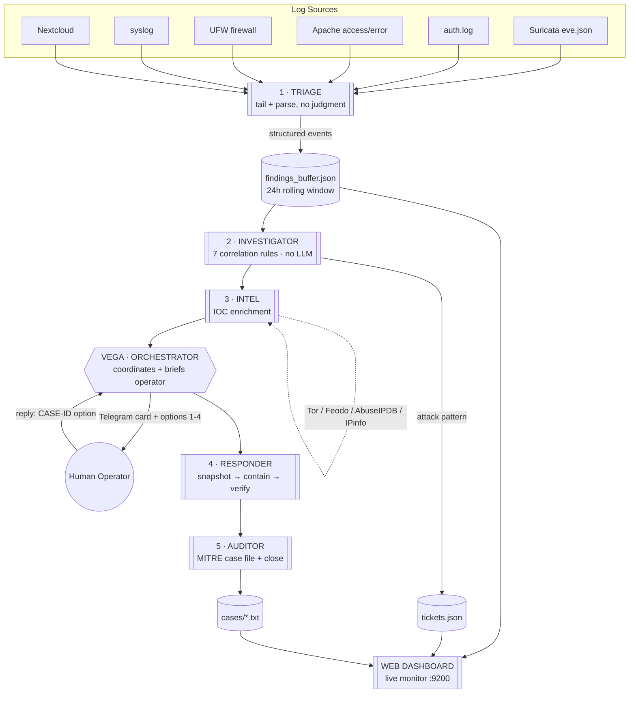

# Vega SOC — Multi-Agent Security Operations Center

> An autonomous, human-in-the-loop Security Operations Center for Linux hosts. Six specialized agents detect multi-stage attacks, enrich indicators, and walk a human operator through containment — all coordinated through a single orchestrator and driven by a deterministic correlation engine that costs **zero LLM tokens per event**.


---

## Why this exists

Most home-grown detection scripts do one of two things badly: they either fire a separate LLM call for every log line (expensive and slow), or they alert on single events and drown the operator in noise. Vega SOC is built the way a real SOC reasons — it correlates **sequences** of events into attack narratives, enriches only what matters, and puts a human in the loop at the one decision point that counts: whether to contain.

The heavy lifting (log parsing, correlation, enrichment) is pure Python with no model inference. Language models are used only for the final human-facing brief, keeping the system cheap enough to run 24/7.

---

## Architecture



---

## The six agents

| # | Agent | Role | LLM? |
|---|-------|------|------|
| 1 | **Triage** | Tails 6 log sources as threads, parses every line into structured events, writes to a 24h rolling buffer. Also watches log file sizes to detect tampering. Makes no judgments. | No |
| 2 | **Investigator** | Every 5 min, indexes buffer by source IP and runs 7 correlation rules that detect attack *sequences*. Opens a ticket on match. | No |
| 3 | **Intel** | Enriches suspect IPs against Tor exit nodes, the Feodo C2 tracker (both key-free), and optionally AbuseIPDB + IPinfo. Never sends internal IPs to external APIs. Degrades gracefully. | No |
| 4 | **Responder** | Executes only operator-approved containment. Always snapshots evidence first, then acts, verifies, and logs a documented rollback. Refuses actions that could lock the operator out. | No |
| 5 | **Auditor** | Writes a forensic case file — MITRE ATT&CK mapping, timeline, IOCs, tailored remediation — then closes the ticket. | No |
| 6 | **Orchestrator (Vega)** | Starts Triage, schedules Investigator, pipes incidents through Intel, briefs the operator via Telegram, and dispatches Responder + Auditor on approval. | LLM for briefs only |

---

## Detection rules

Each rule looks for a multi-stage sequence, not a single event, and maps to MITRE ATT&CK.

| Rule | Trigger | Severity | ATT&CK |
|------|---------|----------|--------|
| **R1** Recon → Exploit | Port scan → exploit/auth attempt from same IP within 10 min | High | T1595 → T1190 |
| **R2** Brute Force Success | 5+ failed logins → success from same IP | Critical | T1110.001, T1078 |
| **R3** Login → C2 | Login success → outbound connection within 2 min | Critical | T1078, T1071 |
| **R4** Lateral Movement | Internal host scanning 5+ other internal hosts | Critical | T1021.004 |
| **R5** Exfiltration | Login from new IP → >50 MB outbound within 10 min | Critical | T1048 |
| **R6** Off-Hours | External IP activity between 02:00–05:00 UTC | High | T1078 |
| **R7** Log Tampering | A monitored log file shrinks | Critical | T1070.002 |

R3 and R5 depend on Suricata flow data and degrade gracefully (return no match) when it isn't available.

---

## Incident lifecycle

1. **Triage** captures events into the buffer.
2. **Investigator** correlates them into an attack pattern and opens a ticket.
3. **Intel** enriches the indicators.
4. **Vega** sends a Telegram card: severity, summary, intel, and four response options.
5. Operator replies `CASE-0138 2`.
6. **Responder** snapshots evidence, then contains (option 1–3) or the case is closed (option 4).
7. **Auditor** writes the MITRE-mapped case file and closes the ticket.
8. **Vega** confirms back to the operator.

**Response options**

| Option | Action |
|--------|--------|
| 1 | Full containment — block IP, kill sessions, block outbound C2 |
| 2 | Soft containment — block IP, preserve sessions for forensics |
| 3 | Observe only — snapshot evidence, no blocking |
| 4 | False positive — close case |

---

## Live dashboard

A dependency-free web dashboard (`dashboard/soc_dashboard.py`, stdlib `http.server` only) serves four live panels, auto-refreshing every 5 seconds:

- **Agent Health** — service status, buffer size, last-event age, investigator cycle timing, events per source
- **Ticket Board** — all tickets sorted by severity with the rule that fired
- **Metrics & MITRE** — tickets-per-rule bar chart, severity donut, and an ATT&CK coverage grid
- **Live Event Feed** — the newest 300 parsed events streaming in

Reachable at `http://<host>:9200` from any device on the LAN.

---

## Quickstart

```bash
git clone https://github.com/<you>/vega-soc.git
cd vega-soc

# 1. Configure environment
cp .env.example .env
#    edit .env — set SOC_SERVER_IPS, TELEGRAM_BOT_TOKEN, TELEGRAM_CHAT_ID

# 2. Deploy (installs agents, dashboard, sudoers rules, systemd services)
chmod +x setup.sh
./setup.sh

# 3. Watch it run
journalctl --user -u soc-orchestrator -f
#    open the dashboard at http://<host>:9200
```

Requires Python 3.10+, a Linux host with systemd (user services), and — for full detection — Suricata, UFW, and standard system logs. Telegram and threat-intel API keys are optional; the system runs without them.

---

## Project structure

```
vega-soc/
├── agents/
│   ├── triage.py         # 1 · log collector
│   ├── investigator.py   # 2 · correlation engine (7 rules)
│   ├── intel.py          # 3 · IOC enrichment
│   ├── responder.py      # 4 · containment executor
│   ├── auditor.py        # 5 · forensic case writer
│   └── orchestrator.py   # 6 · Vega coordinator
├── dashboard/
│   └── soc_dashboard.py  # live web monitor (stdlib only)
├── skills/vega-soc/
│   └── SKILL.md          # teaches Vega to parse operator replies
├── systemd/
│   ├── soc-orchestrator.service
│   └── soc-dashboard.service
├── docs/
│   └── DESIGN.md         # architecture decisions & tradeoffs
├── setup.sh              # idempotent deploy script
└── .env.example
```

---

## Design principles

- **Deterministic first.** Correlation and enrichment are pure Python. No token cost per event; the LLM only writes the operator brief.
- **Human in the loop.** No containment action executes without explicit operator approval.
- **Evidence before action.** The Responder always snapshots system state before touching anything, and logs a rollback for every action.
- **Fail safe.** Rules degrade gracefully when data is missing; the Responder refuses actions that could lock the operator out.
- **Prompt-injection boundary.** Log content is only ever quoted, never executed or evaluated.

See [`docs/DESIGN.md`](docs/DESIGN.md) for the full rationale behind each decision.

---

## Roadmap

- Kill-chain state machine — track an attacker across stages and escalate severity as a campaign progresses
- Behavioral baselining — per-user login-time and source-IP anomaly detection
- `message repeated N times` log-collapse parsing for accurate brute-force counts
- Quiet-hours alert suppression and severity-based routing
- OCSF/ECS export for case files

---

## Disclaimer

Built as a home-lab portfolio project. It is a detection and response *aid*, not a certified security product. Containment actions modify firewall rules, terminate sessions, and stop services — review the approved-action list in `responder.py` before deploying anywhere you care about.

## License

MIT — see [LICENSE](LICENSE).
