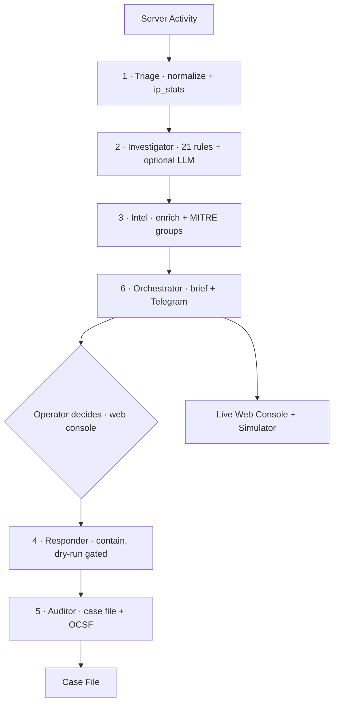

# Agentic SOC — Multi-Agent Security Operations Center

> A round-the-clock threat detection and response platform that catches multi-stage cyber attacks in real time and guides a human analyst through containment — automation for speed, a human for the decisions that matter. Six coordinated agents model a real SOC team, mapped to 21 MITRE ATT&CK techniques, with a live web console and an interactive simulator you can drive from a browser.


---

## The idea

A real Security Operations Center is a team of people, each with a clear job: someone watches the alerts, someone investigates the suspicious ones, someone looks up whether an address is known-bad, someone decides what to do, someone carries out the fix, and someone writes up what happened.

This project asks a simple question: **what if each of those roles were its own agent, and they worked a case together — start to finish — on their own?**

So that's how it's built. Six agents, one per real-world SOC role, coordinated by a single conductor. They watch a Linux host continuously, correlate activity into multi-stage attacks, enrich each incident with threat intelligence, and package it into a decision-ready brief. But they never pull the trigger alone. At the one moment that actually matters — *should we contain this?* — a human makes the call from a web console. The machines handle the speed and the paperwork; the person keeps the judgment. **Automate the work, keep the human in the loop.**

---

## Try it in 60 seconds — the SOC Simulator

The fastest way to understand the system is to watch it work. The **SOC Simulator** (`v2/soc_demo.py`) runs the *real* agents against an attack log — uploaded or built-in — in an isolated sandbox that never touches the live system.

```bash
python3 v2/soc_demo.py          # open http://<host>:5010
```

Pick a built-in scenario (SSH brute-force, password spray, recon→exploit, defense-tool disable, Nextcloud web brute) or **upload your own log** (`v2/samples/attack_scenario.log` is a full multi-stage intrusion). Then watch, top to bottom:

- the **seven pipeline stages light up** as the case moves through them,
- each agent narrates its own activity and shows the **exact data it hands to the next** (`ip_stats → ticket → intel_summary → brief → commands → case file`),
- incidents appear with severity, MITRE technique, and **attributed threat groups** (e.g. APT28, FIN7),
- you click an action, and the **Responder terminal prints the real containment commands** it would run (dry-run) — with the safety guardrails refusing to block your own network or lock the operator.

One screen, the whole SOC operating end to end.

---

## Architecture


```mermaid
flowchart TD
    LOGS[Server Activity] --> T[1 · Triage · normalize + ip_stats]
    T --> I[2 · Investigator · 21 rules + optional LLM]
    I --> N[3 · Intel · enrich + MITRE groups]
    N --> O[6 · Orchestrator · brief + Telegram]
    O --> H{Operator decides · web console}
    H --> R[4 · Responder · contain, dry-run gated]
    R --> A[5 · Auditor · case file + OCSF]
    A --> C[Case File]
    O --> W[Live Web Console + Simulator]
```

**Two-stage detection.** Stage 1 is deterministic Python — a per-IP statistics store (`ip_stats.json`) that every rule reads with a simple lookup, so detection is fast, free, and fully auditable. Stage 2 is an **optional local LLM** that reviews only the IPs no rule matched, catching novel patterns — structured summaries in, JSON out, and it never sees raw logs or makes a containment call.

---

## The six agents

### 1 · Triage — the watcher
Tails every host log at once (Suricata, `auth.log`, `syslog`, Apache, UFW, Nextcloud), surviving log rotation, and normalizes each line into a uniform event with a `uuid` id. It maintains a live **per-IP statistics store** — the single structured input the Investigator reads — and pre-flags high-confidence single-event signals (defense-tool disable, account creation, log tampering) straight to a ticket. It also expands sshd's collapsed `message repeated N times` so brute-force counts are accurate.

### 2 · Investigator — the analyst
The detection brain, pure logic, no LLM in Stage 1. Every cycle it applies **21 correlation rules** over `ip_stats` — reading *sequences*, not single events (a scan then a login, five failures then a success, a login then data leaving). Each rule maps to a MITRE ATT&CK technique and a severity. Tickets are deduplicated against the store (not timestamps), so restarts never skip or double-fire. An optional LLM Stage 2 handles anything the rules miss.

### 3 · Intel — the researcher
Enriches suspicious external IPs against local threat feeds (Tor exits, Feodo C2, Emerging Threats, Spamhaus) plus optional AbuseIPDB / IPinfo / GreyNoise / Shodan. It looks up **which threat-actor groups are known to use the detected technique** from a local MITRE ATT&CK STIX bundle (no API call), correlates prior tickets from the same IP, and emits a clean `intel_summary`. Internal IPs are never sent to external services; priority-aware routing skips enrichment for criticals.

### 4 · Responder — the operator
Executes only operator-approved containment, and **defaults to dry-run** (logs the exact command, runs nothing). A 5-check pre-flight gate guards every action; it snapshots system state before touching anything; and it refuses to block protected ranges (your LAN, Tailscale, loopback) or lock protected users. Its action library covers block-IP, kill-session, disable-account, remove-cron, restore-tool, disable-service, and manual-review — each logged with an executable rollback string.

### 5 · Auditor — the scribe
Turns a closed case into a forensic record: timeline, indicators, a full **MITRE ATT&CK chain**, threat-intel context, the containment actions taken, a **NIST/SANS incident-response phase table**, and a rule-specific remediation checklist. It writes a human-readable Markdown case file *and* a machine-readable **OCSF** export, then closes the ticket. Every case file is a portfolio-ready incident report.

### 6 · Orchestrator (Vega) — the shift lead
The conductor and single point of contact. It starts Triage, schedules the Investigator and Intel cycles, routes cases by severity, and pushes a plain-text **Telegram** notification with a link. Operator **decisions happen in the web console** (a Flask `/briefs` → `/brief/<id>` → `/respond` flow), which writes a small handoff file the Orchestrator polls to dispatch the Responder — a deterministic path with no LLM in the decision loop.

---

## Detection coverage

21 rules across the ATT&CK matrix, spanning Reconnaissance, Initial Access, Credential Access, Persistence, Privilege Escalation, Defense Evasion, Lateral Movement, and Impact — e.g. brute-force success (T1110.001), password spraying (T1110.003), default-account use (T1078.001), cron & service persistence (T1053.003 / T1543.002), defense-tool disabling (T1562.001), log & history tampering (T1070), and Nextcloud web brute-force. Two flow-dependent rules (C2, exfiltration) are staged for the Suricata-flow tier.

---

## Tech stack

| Technology | Why it's used |
|------------|---------------|
| **Python 3.10+** (stdlib: `threading`, `http.server`, `urllib`, `json`, `subprocess`, `ipaddress`) | All six agents — concurrent log tailing, correlation, containment. Zero third-party deps in the detection core. |
| **Flask** | The operator web console and the SOC Simulator. |
| **systemd** | Runs the pipeline as an always-on, auto-restarting service. |
| **Suricata · UFW · auth.log · syslog · Apache · Nextcloud** | The host log sources Triage ingests. |
| **MITRE ATT&CK (STIX)** | Local technique→threat-group lookup and case-file mapping. |
| **NIST / SANS IR lifecycle** | Shapes the containment→recovery steps in each case file. |
| **Local LLM (LM Studio / Ollama, e.g. qwen)** | Optional Stage-2 novel-attack detection and brief narration. Never used for rule detection. |
| **Telegram Bot API** | Read-only push notifications with a link to the console. |
| **Threat feeds + AbuseIPDB / IPinfo / GreyNoise / Shodan** | IP reputation for the Intel agent (feeds free; APIs optional). |
| **OCSF** | Machine-readable case-file export. |

Runtime is Python's standard library plus Flask — nothing heavy to install.

---

## Repository layout

```
agentic-soc/
├── v2/                       # current system
│   ├── triage_agent.py       # 1 · collector + ip_stats
│   ├── investigator_agent.py # 2 · 21-rule engine + LLM stage 2
│   ├── intel_agent.py        # 3 · enrichment + MITRE groups
│   ├── responder_agent.py    # 4 · containment (dry-run gated)
│   ├── auditor_agent.py      # 5 · case files + OCSF
│   ├── orchestrator_v2.py    # 6 · conductor
│   ├── soc_web.py            # operator web console (briefs + respond)
│   ├── soc_demo.py           # SOC Simulator (interactive demo)
│   ├── samples/              # example attack logs
│   └── soc-v2.service        # systemd unit
├── soc multiagent model/     # design docs (architecture, rules, requirements)
├── agents/                   # V1 (original release, kept for history)
├── dashboard/                # agent-activity dashboard
└── README.md
```

---

## Design principles

- **Deterministic first.** Rules and enrichment are plain Python — no token cost per event. The LLM is optional and never makes a detection or containment decision.
- **Human in the loop.** No containment runs without explicit operator approval, from the web console.
- **Safe by default.** The Responder is dry-run by default, snapshots evidence before acting, refuses to block protected ranges or lock protected users, and logs a rollback for everything.
- **Restart-safe state.** Deduplication is `event_id`/ticket-based, not timestamp-based.
- **Prompt-injection boundary.** Log content is only ever parsed and quoted — never executed or fed to a model as an instruction.

Full architecture reasoning lives in [`soc multiagent model/`](soc%20multiagent%20model/).

---

## Disclaimer

Built as a home-lab portfolio project — a detection and response *aid*, not a certified security product. The Responder ships in dry-run mode; review the approved-action list in `v2/responder_agent.py` before enabling live containment anywhere that matters.

## License

MIT — see [LICENSE](LICENSE).
